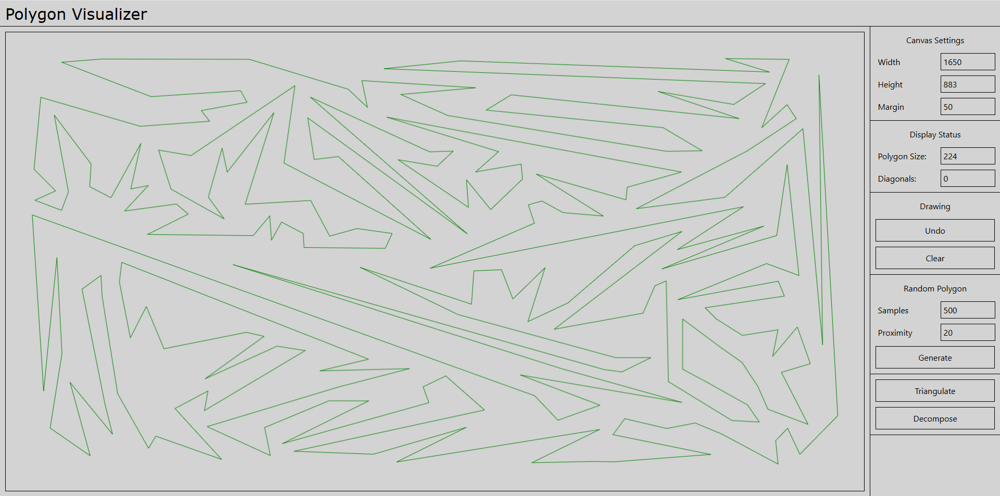
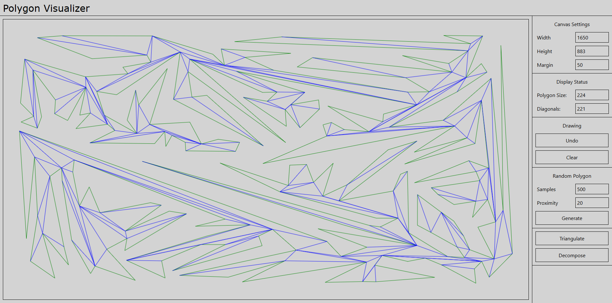
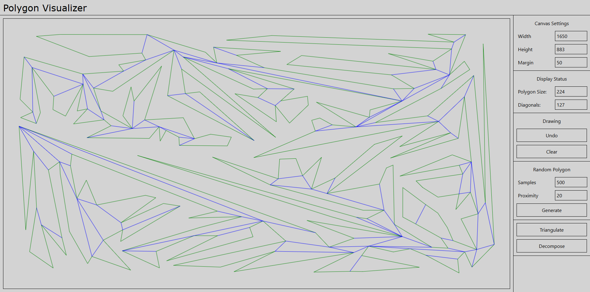

# Polygon Visualizer

An implementation and visualization of the Hertel-Mehlhorn convex decomposition algorithm, based on a triangulation by ear clipping.

Hosted at: https://triangulation.netlify.app

## Screenshots

